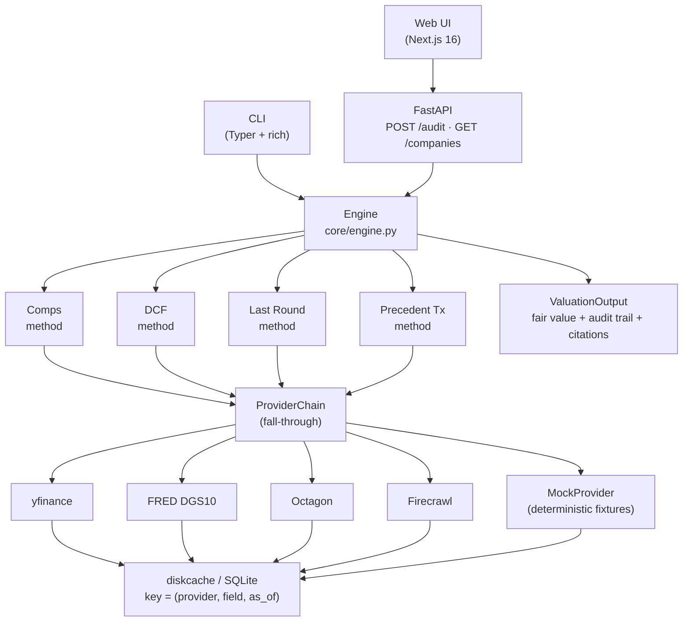

# Architecture

Modus is two apps sharing a single data contract: a Python backend that does all
the valuation work and emits a `ValuationOutput`, and a Next.js frontend that
renders it. The CLI and the HTTP API are two different front ends over the same
engine.

## Component diagram



### ASCII fallback

```
          ┌─────────────────────────────┐          ┌──────────────────────┐
          │  CLI  (Typer, rich)         │          │  Web UI (Next.js 16) │
          │  modus audit ...            │          │  form → results page │
          └──────────────┬──────────────┘          └──────────┬───────────┘
                         │                                    │ fetch
                         ▼                                    ▼
                ┌──────────────────┐              ┌───────────────────────┐
                │  Engine          │◀─────────────│  FastAPI  (api.py)    │
                │  (core/engine)   │              │  POST /audit          │
                └────────┬─────────┘              │  GET  /companies      │
                         │                        └───────────────────────┘
                         │ runs each method
         ┌───────────────┼───────────────┐
         ▼               ▼               ▼
   ┌──────────┐   ┌──────────┐   ┌──────────────┐
   │ Comps    │   │ DCF      │   │ Last Round   │
   │ (method) │   │ (method) │   │ (method)     │
   └────┬─────┘   └────┬─────┘   └──────┬───────┘
        │              │                │
        └──────────────┴────────────────┘
                       │  uses
                       ▼
              ┌──────────────────┐
              │ ProviderChain    │  tries each in order,
              │                  │  falls through on error
              └────────┬─────────┘
                       │
        ┌──────────────┼──────────────┐
        ▼              ▼              ▼
  ┌───────────┐  ┌──────────┐  ┌──────────────┐
  │ yfinance  │  │ FRED     │  │ MockProvider │ ← deterministic fixtures
  │ provider  │  │ DGS10    │  │  (always     │   (JSON in data/fixtures)
  └───────────┘  └──────────┘  │   succeeds)  │
                               └──────────────┘
                       │
                       ▼
               ┌──────────────┐
               │ diskcache    │  SQLite, keyed on
               │ SQLite cache │  (provider, key, as_of)
               └──────────────┘
```

## Data flow

1. **Request in.** CLI or POST body arrives as a `CompanyInput` (Pydantic).
2. **Engine starts audit trail.** First step records the company, requested
   methods, and weight overrides.
3. **Each method runs.** Inside its `evaluate(company, providers)`:
   - Pull data via `providers.<method_name>(...)`. The chain tries live
     providers, then mock. Each successful call returns a dataclass carrying a
     `Citation`.
   - Apply transformations. Every transformation records an `AuditStep` with
     inputs, outputs, citations, and `Assumption` rows for any hardcoded
     number.
   - Return a `MethodResult` with a sorted `Range`, a confidence, and its step
     list.
4. **Engine aggregates.** `core/aggregation.blend(results, weights)` produces
   the final blended `Range`. Zero-confidence methods are dropped before blending.
5. **Engine wraps up.** A final audit step records the resolved weights, the
   per-method contributions, and the blended range. All method steps are
   concatenated into a single trail and renumbered.
6. **Output.** `ValuationOutput` (serializable, JSON-dumpable) is returned to the
   caller. The CLI also renders a markdown report next to the JSON.

## Key contracts

- **`ValuationMethod` Protocol** (`methods/base.py`) — one method, one file. Must
  implement `name`, `evaluate(company, providers) -> MethodResult`.
- **`Provider` Protocol** (`data/providers/base.py`) — data fetchers declare the
  methods they support (`peer_multiples`, `risk_free_rate`, `index_return`). The
  `ProviderChain._call` loop tries each provider; any `ProviderError` or missing
  attribute falls through.
- **Pydantic v2 models** (`core/models.py`) — `Range` enforces monotonicity via
  `model_validator`. `AuditStep` uses `extra="forbid"` so drift is caught.
- **Cache key** — `(provider_name, logical_key, as_of_date)`. Same inputs on the
  same day always produce the same bytes. Deterministic demos across runs.

## Why it's shaped this way

- **Plugins over hardcoding methods.** Adding precedent transactions is one new
  file plus one line in `engine.build_default_methods`.
- **Provider chain over a single source.** Every VC audit tool that hardcodes one
  API dies when the key expires. The chain degrades gracefully and labels mocked
  data honestly.
- **Audit trail is a first-class output, not a log file.** It's the product — so
  it's typed, serializable, and rendered by both the CLI and the UI.
- **CLI and API share the engine.** No business logic lives in `cli.py` or
  `api.py`; they're 20-line adapters around `Engine.run`.
